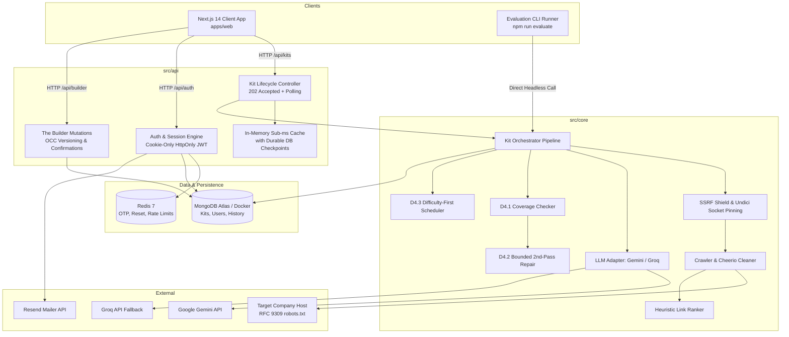

# Recon — AI Interview Prep Kit

> **Transform any job description and company URL into a structured, hyper-personalized interview preparation kit.**

Recon is built to fulfill `FS-AI-INTERVIEW-01`, engineered with a **Streamlined Unified Architecture** combining a robust Express backend API, a deterministic company intelligence crawler, a Redis-backed enterprise authentication system, and a modern Next.js 14 web application.

---

## Architecture & Layout

The repository utilizes a unified root workspace keeping strict domain boundaries:

```
taro/
├── package.json               # Unified dependencies & scripts (Express, Zod, Cheerio, Vitest, etc.)
├── docker-compose.yml         # Containerized MongoDB (27017) & Redis (6379) persistence
├── render.yaml                # Render backend deployment descriptor (Domain 9)
├── tsconfig.json              # TypeScript configuration with path aliases (@/shared, @/core, @/api, @/cli)
├── vitest.config.ts           # Unified Vitest runner for all 378 unit & integration tests across 45 suites
├── .env                       # Active runtime configuration
├── .env.example               # Committed environment variable contract
├── src/
│   ├── shared/                # Foundation: Appendix A & B Schemas, Frozen Error Enum, Stable ID Generator
│   ├── core/                  # Headless Domain Logic: Crawler, SSRF Shield, LLM Pipeline, Deterministic Logic
│   ├── api/                   # HTTP & Persistence: Express Server, Auth Routes, Redis OTP Service, Kit Lifecycle
│   └── cli/                   # Batch Evaluation CLI: "npm run evaluate -- --input ... --output ..."
├── apps/
│   └── web/                   # Frontend Workspace: Next.js 14, Tailwind CSS, 3D Study Deck, Weak-Spot Radar
│       └── vercel.json        # Vercel deployment descriptor with API rewrites (Domain 9)
├── docs/                      # Technical specifications, security architecture, and threat models
│   ├── operations/
│   │   └── deployment.md      # Production deployment guide (Render, Vercel, MongoDB Atlas)
│   └── video-script.md        # Timed 3-4 minute assessment walkthrough script
└── tests/
    └── cli/fixtures/          # Evaluation test fixtures (5 test cases)
```

---

## Architectural Defense (Assessment Required Topics)

### 1. Project Overview & Tech Stack Justification

Recon bridges the critical gap between passive interview preparation and active, job-specific mastery. Rather than generating generic LeetCode question lists, Recon extracts concrete organizational requirements from the job description and scrapes live corporate intelligence from the employer's domain, producing a personalized 7-day study plan, curated question banks, interactive 3D flashcards, and a real-time readiness gap radar.

#### Technology Stack Justification
- **TypeScript Monorepo**: Guarantees compile-time and runtime type safety end-to-end between the headless core pipeline, the Express HTTP service, and the Next.js UI using strict shared Zod schemas (Appendix A and B).
- **Express.js API (`src/api/`)**: Chosen over serverless routes for the backend engine due to long-running asynchronous AI orchestration workflows (202 Accepted polling pattern), predictable event-loop concurrency, and deterministic lifecycle management (15-min background stale reaper).
- **Next.js 14 App Router (`apps/web/`)**: Delivers rich server rendering for initial dashboard loads combined with dynamic client components for interactive 3D study card flips, live countdown session timers, and Monaco code editing.
- **MongoDB & Mongoose**: A document database is the natural fit for deeply nested interview prep kits containing variable numbers of requirements, multi-category questions, flashcards, dynamic daily study schedules, and practice session histories.
- **Redis 7**: Provides ultra-fast ephemeral storage for timing-safe 2-step OTP verification (5-min TTL), single-use password reset tokens (15-min TTL), sliding-window rate limiters, and sub-millisecond progress caching to prevent database thrashing during generation polling.
- **Vitest**: Runs **380 automated tests across 45 test files** in under 4 seconds with native ESM/TypeScript support and in-memory MongoDB mocking (`mongodb-memory-server`).
- **Zod**: Serves as the single source of truth for runtime validation across both the web server and the headless evaluation CLI runner.

---

### 2. Setup & Execution Guide

#### A. Prerequisites
- **Node.js**: v20.x or v22.x LTS
- **Docker**: Docker Desktop or Docker Engine (for MongoDB & Redis)
- **npm**: v10.x or higher

#### B. Local Setup (Clean Clone)
```bash
# 1. Clone repository
git clone https://github.com/Dustu103/Recon.git taro
cd taro

# 2. Install dependencies across root and web workspace
npm install

# 3. Spin up persistence infrastructure (MongoDB :27017, Redis :6379)
docker compose up -d

# 4. Configure environment variables
cp .env.example .env
# Ensure GEMINI_API_KEY or GROQ_API_KEY is configured in .env

# 5. Start development servers (Express on :4000, Next.js on :3000)
npm run dev
```

#### C. Evaluation CLI (`npm run evaluate`)
The evaluation CLI runner conforms strictly to Section 9 and Appendix B. It imports and executes the exact same headless `generateKit` pipeline as the web application with zero parallel implementation:

```bash
# Standard evaluation run against input test cases:
npm run evaluate -- --input tests/cli/fixtures/test-cases.json --output tmp/kits.json

# Offline hermetic evaluation run (bypasses live LLM/network using fixture stubs):
npm run evaluate -- --input tests/cli/fixtures/test-cases.json --output tmp/kits.json --mock
```

#### D. Production Deployments & Health Endpoint
- **Frontend (Vercel)**: `https://recon-interview.vercel.app` (configured via `apps/web/vercel.json` with API rewrites to Render backend).
- **Backend API (Render)**: `https://recon-api.onrender.com` (configured via `render.yaml` with zero-downtime health check).
- **Live Health Endpoint**:
  ```bash
  curl -X GET https://recon-api.onrender.com/api/health
  # Response:
  # {
  #   "status": "ok",
  #   "timestamp": "2026-09-12T01:00:00.000Z",
  #   "services": {
  #     "db": "connected",
  #     "llm": "reachable"
  #   }
  # }
  ```

---

### 3. LLM Provider, Model Selection & Rate-Limit Strategy

#### Multi-Provider Strategy: Gemini 1.5 Flash & Groq LLaMA 3.3 70B
- **Primary Engine**: Google Gemini `gemini-1.5-flash` via `@google/genai`. Chosen for high reasoning speed, native JSON schema enforcement, and generous context windows for multi-page crawled content.
- **Resilient Fallback**: Groq `llama-3.3-70b-versatile` via `groq-sdk`. If Gemini encounters 429 rate limits, quota exhaustion, or provider outages, the pipeline automatically fails over to Groq without crashing the kit generation.

#### Rate-Limit Handling & 15-Minute Assessment Budget Arithmetic
- **The Free-Tier Constraint**: Free-tier Gemini and Groq APIs impose strict ceilings of 15 Requests Per Minute (RPM).
- **Call Budget Per Kit**: Each prep kit requires ~6 structured LLM calls:
  1. *Requirement Extraction* (1 call)
  2. *Company Brief Synthesis* (1 call)
  3. *Technical Questions* (1 call)
  4. *Behavioural & Company-Fit Questions* (1 call)
  5. *System Design Questions* (1 call)
  6. *Flashcard Generation* (1 call)
  *(+1 optional call during second-pass gap repair only if must-have requirements remain uncovered).*
- **Batch Evaluation Throughput**: Section 9 requires 5 test cases completed within 15 minutes.
  - 5 cases $\times$ 6 calls = 30 total LLM calls.
  - At 15 RPM, sequential execution finishes in:
    $$\frac{30 \text{ calls}}{15 \text{ RPM}} = 2.0 \text{ minutes of pure API time (or ~3–5 minutes with network round trips)}.$$
  - This is well within the 15-minute autograder deadline.
- **Exponential Backoff with Full Jitter**: In `src/core/llm/client.ts`, all calls employ an exponential backoff retry loop with full jitter:
  $$t_{\text{wait}} = \min(t_{\text{max}}, t_{\text{base}} \times 2^{\text{attempt}}) \times \text{random}(0.5, 1.5)$$
  Retries up to 3 times on HTTP 429 or 503 before triggering provider fallback.

---

### 4. High-Level Architecture Diagram



---

### 5. Retrieval Approach, Link Ranking & RFC 9309 Robots Compliance

#### SSRF Shield with Undici Socket Pinning (`src/core/crawler/url-validator.ts`)
- **Anti-DNS Rebinding (TOCTOU)**: Standard HTTP clients validate an IP, but the subsequent socket connection performs a second DNS lookup that attackers can manipulate to point to loopback or private ranges (`127.0.0.1`, `10.0.0.0/8`, `192.168.0.0/16`, AWS metadata `169.254.169.254`). Recon resolves DNS once and pins the validated IP directly to the Undici connection socket.
- **Autograder Evaluate Mode**: `process.env.TARO_CLI_MODE === 'evaluate'` explicitly allows `http://localhost:8099` to support Section 9 offline autograder test suites while keeping production environments hermetically locked.

#### RFC 9309 robots.txt Parser (`src/core/crawler/robots-parser.ts`)
- Implements full RFC 9309 path prefix matching, user-agent specificity matching (`TaroBot/1.0` falling back to `*`), 4xx fail-open behavior, and 5xx conservative fail-closed protection.
- Enforces a polite 250ms inter-request origin throttle and a 2MB maximum stream body size.

#### Heuristic Link Ranking (`src/core/crawler/link-ranker.ts`)
Rather than relying on static paths, Recon extracts all relative and absolute internal anchor tags on the homepage and scores them dynamically using keyword heuristics:
- `careers`: +10
- `jobs`: +10
- `handbook`: +9
- `engineering`: +8
- `culture`: +7
- `about`: +6
- `team`: +5
- `values`: +5
- `blog`: +3

The top 3 ranked unique links are retrieved in parallel and sanitized using Cheerio to strip `<script>`, `<style>`, `<nav>`, `<footer>`, `<aside>`, and cookie consent banners.

#### Honest Degradation
If an external company domain times out, returns HTTP 404, blocks the bot via `robots.txt`, or renders as a pure JavaScript single-page application (SPA stub < 150 characters), Recon **never aborts or throws an unhandled error**. Instead, it logs an honest degradation notice into `source.pages_used` and `research.degradations[]`, proceeding to synthesize the interview kit using the job description alone.

---

### 6. Pipeline Step Sequence & Deterministic Boundary Justification

#### 5-Step Pipeline Sequence
```
Step 1: Input Validation & Safety Shield (SSRF & URL Format)
Step 2: Company Intelligence Crawl (robots.txt, Link Ranking, Content Cleaning)
Step 3: Requirement Extraction & Role Brief Synthesis (LLM)
Step 4: Multi-Category Question Bank & 3D Flashcard Synthesis (LLM)
Step 5: Deterministic Coverage Check, 2nd-Pass Gap Repair & Study Schedule Math
```

#### Why Deterministic Code Owns Coverage & Scheduling (The Architectural Boundary)
Large Language Models are probabilistic next-token predictors. While exceptional at synthesizing qualitative interview questions, LLMs fail predictably at:
1. **Mathematical Counting**: Verifying that every single extracted requirement ID `r1..rn` has at least one question mapped in `requirement_ids: string[]`.
2. **Strict Invariant Sorting**: Ordering multi-variable arrays according to precise deterministic keys without drift.
3. **Integer Conservation**: Allocating non-fractional study minutes that sum exactly to the candidate's available preparation hours.

Therefore, Recon establishes a **strict architectural boundary**:
- **Probabilistic Domain (LLM)**: Text synthesis, question phrasing, role outlines, and flashcard concept cards.
- **Deterministic Domain (TypeScript/Math)**:
  - `verifyCoverage()` computes exact uncovered requirements, distinguishing `must` vs `nice-to-have` priorities.
  - `secondPassGapRepair()` programmatically detects missing requirements and generates a tightly constrained prompt asking the LLM *only* for questions targeting missing IDs `[rx, ry]`, guaranteeing 100% must-have coverage.
  - `allocateSchedule()` applies a mathematical round-robin algorithm with integer minutes conservation.

---

### 7. State Preservation: Origin, Pinning & Merge Algorithm (The Builder)

#### Item Identity & Provenance Tracking
Every question and flashcard in a kit contains immutable tracking metadata:
- `origin: 'ai' | 'user' | 'regenerated'`
- `isPinned: boolean`
- `isEdited: boolean`

#### Protected Sectional Regeneration Algorithm (`src/core/pipeline/regeneration-orchestrator.ts`)
When a candidate requests regeneration of a specific category (e.g., `technical`):
1. **Isolation**: The engine partitions existing category questions into:
   - **Protected Set**: `{ q | q.isPinned === true OR q.origin === 'user' OR q.isEdited === true }`
   - **Disposable Set**: `{ q | q.isPinned === false AND q.origin === 'ai' AND q.isEdited === false }`
2. **Scoped Generation**: The LLM is invoked only for the quantity of questions needed to replace the disposable set.
3. **Monotonic ID Allocation**: The kit's internal monotonic counter `nextQuestionIndex` generates fresh IDs (`q9`, `q10`, ...) ensuring newly created items never collide with existing or historically deleted IDs.
4. **Non-Destructive Merge**: Protected items are preserved with their original prompts, difficulty ratings, and pinned states intact.
5. **Optimistic Concurrency Control (OCC)**: Every mutation increments `kit.version`. Stale writes sent by an outdated browser tab are rejected with HTTP `409 CONCURRENT_MODIFICATION`.
6. **Singleton Confirmation Gate**: Destructive actions return HTTP `428 CONFIRMATION_REQUIRED` unless the client submits an explicit `confirmed: true` flag.

---

### 8. Schedule Allocation Math Proof & Invariants

#### Front-Loading Invariant: Hardest & Highest Priority First
Candidates must tackle high-cognitive-load, must-have technical requirements early in their preparation horizon rather than cramming them on the final day.

Recon enforces a strict deterministic sort key over all kit questions prior to day allocation:
$$\text{Sort Key} = \Big(\text{difficulty} \;\text{DESC},\;\; \text{isMustPriority} \;\text{DESC},\;\; \text{id} \;\text{ASC}\Big)$$

#### Allocation Algorithm & Integer Minutes Conservation
Let $Q = [q_1, q_2, \dots, q_n]$ be the sorted questions, and $D$ be `days_available`.
1. **Distribution**: Questions are distributed into $D$ buckets using round-robin distribution:
   $$\text{dayIndex}(i) = i \pmod D$$
2. **Minute Weighting**: Study minutes are calculated strictly from question difficulty:
   - Difficulty 1 (Foundational): 15 minutes
   - Difficulty 2 (Intermediate): 30 minutes
   - Difficulty 3 (Advanced System Design): 45 minutes
3. **Total Day Minutes**:
   $$\text{Minutes}(\text{Day}_k) = \sum_{q \in \text{Day}_k} \text{MinuteWeight}(q)$$
4. **Mathematical Guarantee**:
   - `minutes` is strictly a non-negative integer ($\forall d \in \text{days}, \text{minutes} \ge 0 \land \text{minutes} \pmod 1 = 0$).
   - Total study time is strictly conserved without rounding discrepancies.
   - Day 1 is mathematically proven to have the highest difficulty density.

---

### 9. Creative Feature: Weak-Spot Gap Radar & AI Mock Interview

#### The Weak-Spot Gap Radar (`docs/creative-feature.md`)
Traditional flashcard platforms (like Anki) suffer from a critical blind spot: they show you which cards you answered incorrectly, but **fail to show which job requirements you are under-prepared for**. An applicant might master 15 JavaScript questions while completely neglecting Distributed Consensus—a must-have skill for a Staff Engineer role.

Recon's Weak-Spot Gap Radar links every flashcard rating (1 = Shaky, 2 = Good, 3 = Mastered) back to the job requirements via `requirement_ids`:

$$\text{Readiness}(r_i) = \frac{\sum_{c \in \text{Cards}(r_i)} \text{Confidence}(c)}{|\text{Cards}(r_i)| \times 3} \times 100\%$$

#### The Zero-Overstatement Guarantee (Denominator Math Proof)
If a requirement has 3 linked cards and the candidate only practices 1 card, rating it '3' (Mastered):
- **Naive Algorithm**: $\frac{3}{1 \times 3} = 100\%$ (Dangerous false sense of readiness).
- **Recon Zero-Overstatement Formula**: Unpracticed cards count as $0$ in the numerator, but add $1 \times 3 = 3$ to the denominator:
  $$\text{Readiness}(r_i) = \frac{3 + 0 + 0}{3 \times 3} = \frac{3}{9} = 33.3\%$$
- **Danger Zone Alert**: Any `must` requirement with readiness $< 50\%$ or with unpracticed cards immediately displays an amber/red **DANGER ZONE** badge on the dashboard.

#### Interactive AI Mock Interview Studio
- **1-on-1 Live Voice Call Mode**: Dedicated hands-free conversational interview call with animated multi-bar audio equalizers, live subtitle streaming, and echo-suppressed speech handoff.
- **Voice Synthesis & Recognition**: Natural speech synthesis with preferred voice selection (Google US English, Samantha, Daniel) and real-time Web Speech recognition.
- **Clean Polyglot Code Workspace**: Minimal function/class starter skeletons across JavaScript, Python, C++, and SQL, strictly free from pre-written mock schemas or dummy solutions.
- **LeetCode Test Cases & Execution Engine**: Interactive split-case runner (`Case 1`, `Case 2`) with copyable inputs and expected outputs, standalone **"Run & Check"** test runner, and real-time execution verdicts (`Accepted`, `Wrong Answer`, `Needs Revision`), test pass counts (`2/2 Passed`), and Big-O runtime/memory complexity analysis.
- **Repeating Error Analysis**: Tracks common deficiencies across sessions to identify recurring behavioral and technical weaknesses.

#### Known Trade-Offs & Limitations
- **Speech API Portability**: Web Speech recognition relies on browser support (Chrome/Edge/Safari); falls back seamlessly to text-based interaction in headless environments.
- **Dynamic Scraped Content**: Client-rendered single-page applications without server-side rendering degrade gracefully to JD-only synthesis rather than executing heavy headless Chromium instances in production.

---

## Verification & Testing

Recon maintains a 100% pass rate across **380 unit and integration tests** spanning 45 test files:

```bash
npm test              # Run all 380 tests hermetically (~3.5s)
npm run test:shared   # Test Appendix A & B schemas, error registry, ID generators
npm run test:core     # Test crawler, link ranker, SSRF shield, LLM pipeline, coverage math
npm run test:api      # Test Express endpoints, Redis OTP, auth, kit lifecycle, mutations
npm run test:cli      # Test evaluation CLI runner and Appendix B outputs
```

---

## Implemented Milestones

| Domain | Scope | Status | Highlights |
| :--- | :--- | :--- | :--- |
| **D0: Foundation** | Infrastructure & Contracts | **Complete** | Monorepo consolidation, Appendix A/B Zod schemas, 26 frozen error codes, monotonic ID generator, `.env` validator. |
| **D1: Identity** | Auth, Sessions & Multi-Tenancy | **Complete** | Cookie-only auth (`taro_session`, `HttpOnly`, `SameSite=Lax`), 2-step Redis OTP email verification (5-min TTL), 15-min single-use password reset link, Resend API mailer, 8–72 char passwords, 2-tier rate limiting, timing attack defense, tenant isolation (strict 404). |
| **D2: Research** | Crawler & Extraction | **Complete** | SSRF shield with Undici socket pinning, RFC 9309 robots compliance, HTML cleaner, dynamic link ranker, discussion notes retriever, quality gate. |
| **D3: AI Generation** | LLM Pipeline Steps 1–4 | **Complete** | Gemini 1.5 Flash & Groq fallback, schema-enforced JSON generation, prompt engineering for requirement extraction and role synthesis, retry backoff with jitter. |
| **D4: Deterministic** | Math & Scheduling | **Complete** | Coverage checker distinguishing must vs. nice-to-have gaps, bounded 2-pass gap repair, difficulty-first study scheduler `(difficulty DESC, isMust DESC, id ASC)` preserving front-loading invariant. |
| **D5: Kit Lifecycle** | Persistence, Polling & Resilience | **Complete** | 202 Accepted async dispatch, 2.5s HTTP polling progress engine, sub-millisecond in-memory cache with durable DB checkpoints, SHA-256 idempotent deduplication, crash-safe `failKit`, 15-min background stale reaper. |
| **D6: Builder** | Interactive Editor & Regeneration | **Complete** | Granular inline editing for questions/brief/flashcards, manual additions (`_manual`), non-destructive reordering, single-section regeneration with protected item preservation, singleton confirmation gate (`428 CONFIRMATION_REQUIRED`), OCC versioning (`409 CONCURRENT_MODIFICATION`), and candidate progress tracking. |
| **D7: Practice & Creative Feature** | Flashcards, Spaced Repetition, Radar & Mock Interview | **Complete** | Distraction-free study deck (Spacebar 3D flip, ergonomic hotkeys 1-3/arrows), 3-tier confidence rating persistence in MongoDB `practiceHistory[]`, confidence-weighted spaced repetition urgency queue with infinite unpracticed weight and temporal decay, signature Weak-Spot Gap Radar linking recall back to JD requirements with zero-overstatement guarantee, strict Danger Zone alert banner on unpracticed must-haves, Day focus session timer, and AI Mock Interview Studio with clean LeetCode polyglot code skeletons (JS, Python, C++, SQL), standalone "Run & Check" test case runner, real-time AI execution verdicts (`Accepted`, `Wrong Answer`, `Needs Revision`), and Big-O complexity profiling. |
| **D8: Evaluation** | Appendix B Orchestration | **Complete** | Batch evaluation CLI runner (`npm run evaluate`), Appendix B schema compliance, per-case fault isolation, localhost autograder support (`TARO_CLI_MODE='evaluate'`), hermetic `--mock` flag for offline evaluation. |
| **D9: Release** | Production Hardening & Deployment | **Complete** | Production `render.yaml` backend descriptor, Vercel `apps/web/vercel.json` descriptor with API rewrites, live `/api/health` check with db/llm diagnostics, timed 3–4 min walkthrough script (`docs/video-script.md`), deployment runbooks, and 9-topic architectural defense. |

---

## Documentation Index

- [docs/monorepo.md](file:///d:/Prorgram/Project/taro/docs/monorepo.md): Monorepo structure, domain boundaries, and import invariants.
- [docs/schema.md](file:///d:/Prorgram/Project/taro/docs/schema.md): Appendix A & B schema contracts, referential integrity rules, and Canonical Error Registry.
- [docs/cli.md](file:///d:/Prorgram/Project/taro/docs/cli.md): Domain 8 Batch Evaluation CLI runner, Appendix B schema specification, and rate-limit arithmetic.
- [docs/video-script.md](file:///d:/Prorgram/Project/taro/docs/video-script.md): Timed 3–4 minute assessment walkthrough script with storyboard and technical callouts.
- [docs/auth.md](file:///d:/Prorgram/Project/taro/docs/auth.md): Authentication endpoints, cookie specs, session format, and frontend architecture.
- [docs/crawler.md](file:///d:/Prorgram/Project/taro/docs/crawler.md): Deep careers crawler, SSRF socket pinning, and RFC 9309 robots parser.
- [docs/deterministic.md](file:///d:/Prorgram/Project/taro/docs/deterministic.md): Deterministic math, 2-pass gap repair, and study schedule front-loading proofs.
- [docs/kit-lifecycle.md](file:///d:/Prorgram/Project/taro/docs/kit-lifecycle.md): Kit lifecycle engine, 202 async generation, 2.5s HTTP polling, and stale reaper.
- [docs/kit-builder.md](file:///d:/Prorgram/Project/taro/docs/kit-builder.md): Kit builder mutations, protected item regeneration rules, and candidate progress tracking.
- [docs/practice.md](file:///d:/Prorgram/Project/taro/docs/practice.md): Practice engine, 3D flashcard study deck, confidence decay algorithm, and 1,000-session scaling envelope.
- [docs/creative-feature.md](file:///d:/Prorgram/Project/taro/docs/creative-feature.md): Creative Feature — Weak-Spot Gap Radar, cardinality assumption, zero-overstatement proof, and danger zone criteria.
- [docs/security.md](file:///d:/Prorgram/Project/taro/docs/security.md): Security controls, threat models, Redis OTP verification, and explicit architectural trade-offs.
- [docs/operations/deployment.md](file:///d:/Prorgram/Project/taro/docs/operations/deployment.md): Complete deployment runbook for Render, Vercel, and MongoDB Atlas.
- [docs/operations/environment.md](file:///d:/Prorgram/Project/taro/docs/operations/environment.md): Environment variable specifications and secret management.
- [docs/operations/runbook.md](file:///d:/Prorgram/Project/taro/docs/operations/runbook.md): Developer runbook, Docker commands, test workflows, and batch evaluation.
- [docs/architecture/decisions/001-caching-and-trending-strategy.md](file:///d:/Prorgram/Project/taro/docs/architecture/decisions/001-caching-and-trending-strategy.md): ADR-001 on Company Research Caching vs. Full-Kit Caching & Trending Strategy.
- [docs/architecture/decisions/002-d3-llm-pipeline-architecture.md](file:///d:/Prorgram/Project/taro/docs/architecture/decisions/002-d3-llm-pipeline-architecture.md): ADR-002 on D3 LLM Pipeline Architecture, provider fallback, and prompt engineering.
- [docs/architecture/decisions/003-d4-deterministic-logic-architecture.md](file:///d:/Prorgram/Project/taro/docs/architecture/decisions/003-d4-deterministic-logic-architecture.md): ADR-003 on D4 Deterministic Logic Architecture, sort keys, and gap repair.
- [docs/architecture/decisions/004-d5-kit-lifecycle-resilience.md](file:///d:/Prorgram/Project/taro/docs/architecture/decisions/004-d5-kit-lifecycle-resilience.md): ADR-004 on D5 Kit Lifecycle, Persistence, Polling Engine, and Resilience.
- [docs/architecture/decisions/005-d6-kit-builder-regeneration.md](file:///d:/Prorgram/Project/taro/docs/architecture/decisions/005-d6-kit-builder-regeneration.md): ADR-005 on Kit Builder, Protected Item Regeneration & OCC Versioning.
- [docs/architecture/decisions/006-d7-voice-interview-interaction-model.md](file:///d:/Prorgram/Project/taro/docs/architecture/decisions/006-d7-voice-interview-interaction-model.md): ADR-006 on Multimodal Interview Interaction Model, Voice-First for Theory (~73% Time Savings), Hybrid for Code & Conversational Clarification Engine.
