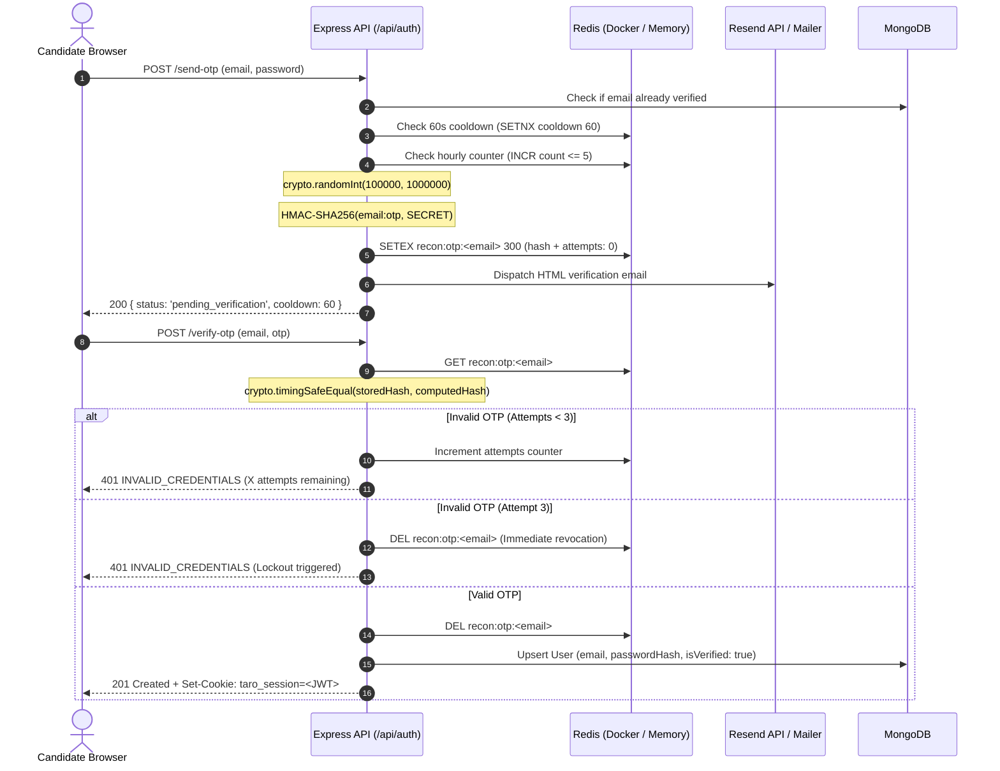

# Domain 1 — Identity & Authentication Specification

## 1. Overview & Architecture

Domain 1 implements authentication and identity management for the Taro AI Interview Prep Kit. The system enforces strict, modern web security standards while keeping the footprint minimal and robust.

### Key Architectural Invariants
1. **Cookie-Only Session Authentication**: Sessions are managed exclusively through an `HttpOnly`, `SameSite=Lax`, `Secure` (in production) cookie named `taro_session`. There is **zero Bearer token fallback** in headers or localStorage, eliminating XSS token exfiltration vectors.
2. **Explicit Password Hashing**: Passwords are explicitly hashed at the controller layer (`await bcrypt.hash(password, 10)`) immediately before database insertion. Mongoose pre-save middleware hooks are deliberately avoided to eliminate hidden lifecycle side effects.
3. **Password Length Boundary (8–72 Chars)**: Passwords are validated using Zod with a minimum length of 8 characters and an explicit maximum of 72 characters. The 72-character maximum prevents bcrypt silent truncation (where characters beyond 72 bytes are ignored by the standard blowfish algorithm).
4. **Constant-Time Timing Attack Mitigation**: If an unknown email is submitted on `/api/auth/login`, the server executes `await bcrypt.compare(password, DUMMY_PASSWORD_HASH)` so that response latencies between valid and invalid emails are indistinguishable.
5. **Tenant-Isolated Kit Access (Strict 404)**: Accessing a kit owned by another user or an invalid kit ID strictly returns `404 Not Found` (`ErrorCode.NOT_FOUND`), never `403 Forbidden`, preventing resource enumeration attacks across tenants.
6. **Two-Tier Rate Limiting**:
   - **Auth Burst Limiter**: 20 requests per minute per IP across all `/api/auth/*` endpoints.
   - **Login Brute-Force Throttle**: 5 failed login attempts per 15-minute window per client IP (`skipSuccessfulRequests: true`). The 6th attempt returns `429 Too Many Requests` with code `AUTH_RATE_LIMITED`.

---

## 2. API Endpoints

### `POST /api/auth/register`
Creates a new user account, sets the session cookie, and returns the sanitized user payload.

- **Rate Limit**: Auth Burst Limiter (20 req/min/IP).
- **Request Body**:
  ```json
  {
    "email": "candidate@example.com",
    "password": "SecurePassword123!"
  }
  ```
- **Responses**:
  - `201 Created`:
    - Headers: `Set-Cookie: taro_session=<JWT>; HttpOnly; Path=/; SameSite=Lax; Max-Age=604800`
    - Body:
      ```json
      {
        "user": {
          "id": "66dee2e249f0322d8616fa12",
          "email": "candidate@example.com",
          "createdAt": "2026-09-09T15:30:00.000Z"
        }
      }
      ```
  - `400 Bad Request`: Validation failure (`ErrorCode.INVALID_INPUT`).
  - `409 Conflict`: User already exists (`ErrorCode.USER_EXISTS`).

### `POST /api/auth/send-otp`
Initiates 2-step candidate onboarding by generating a cryptographically random 6-digit OTP, persisting its HMAC-SHA256 hash in Redis, and dispatching a verification email.

- **Rate Limit**: Auth Burst Limiter (20 req/min/IP) + Anti-Spam Throttle (60s cooldown per email + max 5/hr).
- **Request Body**:
  ```json
  {
    "email": "candidate@example.com",
    "password": "SecurePassword123!"
  }
  ```
- **Responses**:
  - `200 OK`:
    ```json
    {
      "status": "pending_verification",
      "email": "candidate@example.com",
      "cooldownSeconds": 60,
      "devOtp": "657761"
    }
    ```
    *(Note: `devOtp` is only exposed when `NODE_ENV !== 'production'` to facilitate automated testing and offline development).*
  - `400 Bad Request`: Invalid email format or password violating 8–72 char bounds (`ErrorCode.INVALID_INPUT`).
  - `409 Conflict`: Verified account with this email already exists (`ErrorCode.USER_EXISTS`).
  - `429 Too Many Requests`: Triggered if requested within the 60s cooldown or exceeding the 5/hr hourly limit (`ErrorCode.AUTH_RATE_LIMITED`).

### `POST /api/auth/verify-otp`
Validates the submitted 6-digit code against Redis, activates the user account in MongoDB, and issues the `taro_session` HTTP cookie.

- **Rate Limit**: Auth Burst Limiter (20 req/min/IP).
- **Anti-Brute Force**: Maximum 3 failed attempts per OTP code. The 3rd failed attempt immediately revokes and deletes the key from Redis.
- **Timing Defense**: Uses `crypto.timingSafeEqual` over HMAC-SHA256 digests.
- **Request Body**:
  ```json
  {
    "email": "candidate@example.com",
    "otp": "657761"
  }
  ```
- **Responses**:
  - `201 Created`:
    - Headers: `Set-Cookie: taro_session=<JWT>; HttpOnly; Path=/; SameSite=Lax; Max-Age=604800`
    - Body:
      ```json
      {
        "user": {
          "id": "66dee2e249f0322d8616fa12",
          "email": "candidate@example.com",
          "createdAt": "2026-09-09T15:30:00.000Z"
        }
      }
      ```
  - `400 Bad Request`: Code not exactly 6 numeric digits or missing email (`ErrorCode.INVALID_INPUT`).
  - `401 Unauthorized`: Invalid code or code revoked after 3 failed attempts (`ErrorCode.INVALID_CREDENTIALS`).
  - `404 Not Found`: Expired or non-existent verification session (`ErrorCode.NOT_FOUND`).

### `POST /api/auth/resend-otp`
Dispatches a fresh 6-digit OTP code to the candidate's email for an active pending registration session.

- **Rate Limit**: Enforces a strict 60-second cooldown (`SET key NX EX 60`) and max 5/hr throttle.
- **Request Body**:
  ```json
  {
    "email": "candidate@example.com"
  }
  ```
- **Responses**:
  - `200 OK`:
    ```json
    {
      "status": "otp_resent",
      "email": "candidate@example.com",
      "cooldownSeconds": 60,
      "devOtp": "942103"
    }
    ```
  - `400 Bad Request`: Missing email string (`ErrorCode.INVALID_INPUT`).
  - `404 Not Found`: No pending registration session found for this email (`ErrorCode.NOT_FOUND`).
  - `429 Too Many Requests`: Cooldown active (`ErrorCode.AUTH_RATE_LIMITED`).

### `POST /api/auth/login`
Validates user credentials, issues a session cookie, and returns the user payload.

- **Rate Limit**: Auth Burst Limiter (20 req/min) + Login Brute-Force Throttle (5 failed attempts/15 min).
- **Timing Defense**: Unknown email executes `bcrypt.compare(password, DUMMY_PASSWORD_HASH)` before throwing 401.
- **Request Body**:
  ```json
  {
    "email": "candidate@example.com",
    "password": "SecurePassword123!"
  }
  ```
- **Responses**:
  - `200 OK`:
    - Headers: `Set-Cookie: taro_session=<JWT>; HttpOnly; Path=/; SameSite=Lax; Max-Age=604800`
    - Body: User payload object.
  - `401 Unauthorized`: Invalid credentials (`ErrorCode.INVALID_CREDENTIALS`).
  - `429 Too Many Requests`: Threshold exceeded (`ErrorCode.AUTH_RATE_LIMITED`).

### `POST /api/auth/forgot-password`
Initiates a secure password reset workflow by generating a cryptographically random 64-hex token, storing its HMAC-SHA256 hash in Redis with a strict **15-minute TTL** (900 seconds), and dispatching an email containing the single-use reset link (`/reset-password?token=...`).

- **Expiration**: Exactly **15 minutes** (900 seconds).
- **Anti-Enumeration Defense**: If the requested email does not exist in the database, the server runs a dummy bcrypt comparison to preserve constant response time and returns `200 OK` with a generic status, preventing user enumeration.
- **Rate Limit**: Auth Burst Limiter (20 req/min) + 60-second anti-spam cooldown per email (`password_reset_cooldown:<email>`).
- **Request Body**:
  ```json
  {
    "email": "candidate@example.com"
  }
  ```
- **Responses**:
  - `200 OK`:
    ```json
    {
      "status": "reset_link_dispatched",
      "message": "If an account exists with this email address, a password reset link has been dispatched.",
      "cooldownSeconds": 60,
      "devResetLink": "http://localhost:3000/reset-password?token=a8f1e..."
    }
    ```
    *(Note: `devResetLink` is only included when `NODE_ENV !== 'production'` for automated testing).*
  - `400 Bad Request`: Malformed email (`ErrorCode.INVALID_INPUT`).
  - `429 Too Many Requests`: Cooldown active (`ErrorCode.AUTH_RATE_LIMITED`).

### `POST /api/auth/reset-password`
Validates the 15-minute token against Redis, updates the user's password in MongoDB, and **immediately revokes the token** to ensure it cannot be redeemed a second time.

- **Single-Use Guarantee**: The token key is deleted from Redis immediately upon successful password update.
- **Request Body**:
  ```json
  {
    "token": "a8f1e09c...",
    "newPassword": "BrandNewSecurePassword123!"
  }
  ```
- **Responses**:
  - `200 OK`:
    ```json
    {
      "status": "password_reset_success",
      "message": "Password has been updated successfully. Please sign in with your new password.",
      "email": "candidate@example.com"
    }
    ```
  - `400 Bad Request`: Missing token or password violating 8–72 char bounds (`ErrorCode.INVALID_INPUT`).
  - `401 Unauthorized`: Token expired (exceeded 15 minutes) or already used (`ErrorCode.TOKEN_EXPIRED`).

### `POST /api/auth/logout`
Terminates the current session by clearing the `taro_session` cookie.

- **Responses**:
  - `200 OK`:
    - Headers: `Set-Cookie: taro_session=; Path=/; Expires=Thu, 01 Jan 1970 00:00:00 GMT`
    - Body: `{ "status": "ok" }`

### `GET /api/auth/me`
Returns the currently authenticated user's profile.

- **Authentication**: Requires valid `taro_session` cookie.
- **Responses**:
  - `200 OK`:
    ```json
    {
      "user": {
        "id": "66dee2e249f0322d8616fa12",
        "email": "candidate@example.com"
      }
    }
    ```
  - `401 Unauthorized`:
    - Missing or corrupted cookie: `ErrorCode.UNAUTHORIZED`
    - Expired token: `ErrorCode.TOKEN_EXPIRED`

---

## 3. Redis-Backed OTP Verification Architecture

- **OTP TTL**: Exactly **5 minutes** (300 seconds).
- **Resend Cooldown**: **60 seconds** anti-spam throttle.
- **Hourly Dispatch Cap**: Maximum 5 OTP requests per hour per email.
- **Brute-Force Lockout**: Maximum 3 attempts before immediate key revocation from Redis. Valid codes on the 3rd attempt are verified successfully.



## 4. Session Management & Token Format

- **Algorithm**: HMAC SHA-256 (`HS256`) signed with `JWT_SECRET`.
- **Payload**:
  ```json
  {
    "userId": "66dee2e249f0322d8616fa12",
    "email": "candidate@example.com",
    "iat": 1725895800,
    "exp": 1726500600
  }
  ```
- **TTL**: 7 days (604,800 seconds).

---

## 5. Reverse Proxy & Deployment Invariants

In cloud environments where Node runs behind a reverse proxy or TLS termination layer (e.g., Render, Vercel, AWS ALB):
- The server configures `app.set('trust proxy', ['loopback', 'linklocal', 'uniquelocal'])` so that `req.ip` correctly resolves to the real client IP forwarded through `X-Forwarded-For`, rather than the internal gateway IP.
- Frontend requests in development and production route through Next.js rewrites (`/api/:path*`), ensuring same-origin cookie delivery and full compatibility with `SameSite=Lax`.

---

## 6. Web Client Architecture (`apps/web`)

### Next.js Proxy Rewrites (`next.config.js`)
Frontend requests to `/api/:path*` are rewritten internally to the Express server (`http://localhost:4000/api/:path*`). This ensures:
1. Browsers treat API calls as same-origin requests.
2. `SameSite=Lax` cookies are included reliably across all navigation contexts.

### API Client Wrapper (`apps/web/src/lib/api.ts`)
- Standardized `apiFetch<T>()` utility enforcing `credentials: 'include'` and `'Content-Type': 'application/json'`.
- Supports all auth endpoints: `authApi.sendOtp()`, `authApi.verifyOtp()`, `authApi.resendOtp()`, `authApi.login()`, `authApi.logout()`, `authApi.me()`.
- Parses error envelopes and rethrows structured `ApiClientError` instances carrying `code`, `message`, and `status`.

### React Auth Context & Hook (`apps/web/src/hooks/use-auth.tsx`)
Exposes global session state through `useAuth()`:
```tsx
interface AuthContextType {
  user: UserPayload | null;
  isLoading: boolean;
  login: (email: string, password: string) => Promise<void>;
  register: (email: string, password: string) => Promise<void>;
  logout: () => Promise<void>;
  refreshUser: () => Promise<void>;
}
```
- On initial mount, automatically calls `GET /api/auth/me` to hydrate session state.

### Route Protection Component (`apps/web/src/components/auth/protected-route.tsx`)
- Gates authenticated views (such as `/dashboard`).
- Renders an emerald loading spinner while session verification is in progress.
- Automatically redirects unauthenticated users to `/login` via `router.replace('/login')`.

### User Interface Pages & Components
- **`/register` (2-Step Verification)**:
  - **Step 1 (Credentials)**: Email & password form with real-time 8–72 character length indicator, matching password check, and duplicate-account detection. Submitting dispatches `POST /api/auth/send-otp`.
  - **Step 2 (OTP Verification)**: Renders 6 discrete auto-advancing digit boxes with automatic focus progression, backspace recovery, and full clipboard paste support. Includes a live 60-second cooldown timer, dynamic "Resend code" button, and dev helper banner in development.
- **`/login`**: Email & password authentication with dedicated error alerts for invalid credentials and brute-force throttling (`AUTH_RATE_LIMITED`).
- **`/dashboard`**: Protected user workspace displaying session status, active kit statistics, and kit creation CTAs.
- **`<Navbar>`**: Global navigation bar with authenticated candidate indicator and one-click logout.
