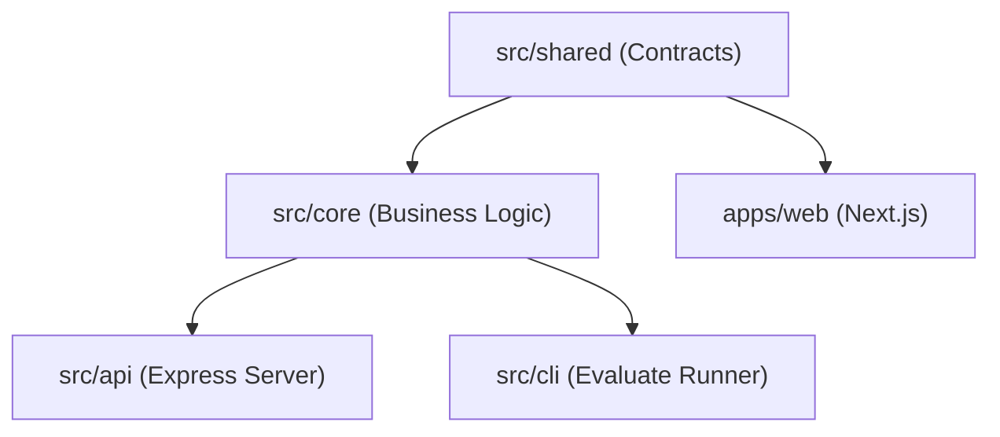

# Taro Streamlined Unified Architecture

## Overview & Project Structure

To maximize development velocity, eliminate complex multi-package build order dependencies, and guarantee that the batch evaluation script runs instantly from a clean clone without build step friction, Taro uses a **Streamlined Unified Architecture**:
- A single unified root package managing shared foundation logic, core domain intelligence, Express API, and evaluation CLI.
- A single isolated workspace (`apps/web`) dedicated to the Next.js frontend application.

```
taro/
├── package.json               # Unified root dependencies (Express, Zod, Cheerio, Vitest, TS, etc.)
├── tsconfig.json              # Single root TypeScript configuration with path aliases (@/shared, @/core, @/api)
├── vitest.config.ts           # Unified Vitest runner for all unit & integration tests
├── .env.example               # Committed environment variable contract
├── .env.test                  # Committed test secrets
├── src/
│   ├── shared/                # Foundation: Types, Appendix A Schemas, Frozen Error Enum, ID Generator
│   ├── core/                  # Headless Domain Logic: Crawler, LLM Client, Pipeline Steps, Deterministic Math
│   │   ├── builder/           # D6 Regeneration Engine: Protected item merge, gap subtraction, monotonic IDs
│   │   └── practice/          # D7 Practice Algorithms: History reducer, spaced repetition queue, weak-spot radar
│   ├── api/                   # HTTP & Persistence: Express Server, Auth Routes, Kit Lifecycle, Practice Persistence
│   └── cli/                   # Batch Evaluation CLI: "npm run evaluate -- --input ... --output ..."
├── apps/
│   └── web/                   # Frontend Workspace: Next.js 14, Study Deck, Spaced Repetition Queue, Weak-Spot Radar
└── tests/
    └── cli/fixtures/          # Evaluation test cases fixtures
```

---

## Strict Domain Boundaries & Import Rules

Even within a unified backend source tree, strict architectural boundaries are enforced:

1. **`src/shared/`** is the leaf foundation:
   - Zero internal dependencies; depends only on `zod`.
   - Dual runtime safe (Node.js & browser).
   - Never imports from `src/core`, `src/api`, or `apps/web`.

2. **`src/core/`** is headless business logic:
   - Imports contracts and errors from `@/shared`.
   - **Zero HTTP or DB dependencies**: pure functions, crawler, LLM client, deterministic scheduler and coverage checker.
   - Never imports from `src/api`, `src/cli`, or `apps/web`.

3. **`src/api/`** and **`src/cli/`**:
   - Both consume headless domain logic from `@/core` and contracts from `@/shared`.
   - Never import from each other or from `apps/web`.
   - **Architectural Guarantee:** `src/cli` and `src/api` call the **exact same** orchestrator in `src/core`. Zero diverging implementations.

4. **`apps/web/`**:
   - Imports shared schemas and contracts from `../../src/shared`.
   - Never imports server/database code or secret credentials.



---

## TypeScript Configuration

A single root `tsconfig.json` provides strict typechecking, output generation (`dist/`), and clean path aliases:

```json
{
  "compilerOptions": {
    "target": "ES2022",
    "module": "CommonJS",
    "moduleResolution": "Node",
    "strict": true,
    "outDir": "./dist",
    "rootDir": "./src",
    "baseUrl": ".",
    "paths": {
      "@/shared/*": ["src/shared/*"],
      "@/core/*": ["src/core/*"],
      "@/api/*": ["src/api/*"],
      "@/cli/*": ["src/cli/*"]
    }
  }
}
```

---

## Command Reference

| Command | Purpose |
| :--- | :--- |
| `npm test` | Runs all 43 test files and 358 unit and integration tests across the unified tree in a single Vitest pass |
| `npm run test:shared` | Runs unit tests for schemas, error codes, and ID generator |
| `npm run test:core` | Runs crawler, link-ranker, and deterministic tests |
| `npm run test:api` | Runs Express API and database integration tests |
| `npm run test:cli` | Runs CLI evaluate runner unit tests |
| `npm run build` | Builds backend API (`tsc`) and Next.js web application (`next build`) |
| `npm run build:api` | Compiles `src/` to `dist/` |
| `npm run build:web` | Builds Next.js frontend in `apps/web` |
| `npm run lint` | Runs ESLint across `apps/web` |
| `npm run evaluate -- --input <cases.json> --output <kits.json>` | Runs Appendix B batch evaluation pipeline via `tsx` from clean clone |
